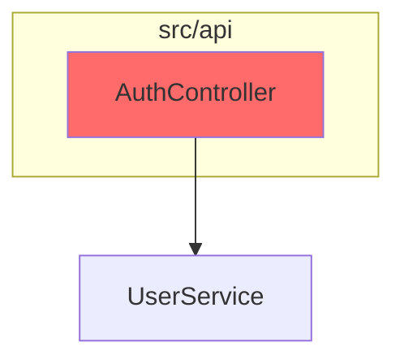

# DRYKISS — Inspiration Backlog

A consolidated, cross-sourced list of improvements for pi-drykiss, derived from:

1. **[brooks-lint](https://github.com/hyhmrright/brooks-lint)** (reassessed fresh — see §2 below)
2. **[antirez: "A new era for software testing"](https://antirez.com/news/168)** — behavioural QA / regression-hunting patterns
3. **Pi-drykiss gaps** surfaced while implementing #1, #2, and the diagnostics work

> **Hard constraint (see `prompt-architecture.md`):** All prompt text MUST live in `.md` files. TypeScript modules MUST NOT contain prompt text as string literals. This constraint governs every item in this document — no item may be implemented by hardcoding a prompt in a `.ts` file.

Items are grouped by source for traceability, then ordered within each group by impact / effort. Cross-source items appear at the end.

> **Status legend:** `[ ]` not started · `[~]` in progress · `[x]` done · `[skip]` rejected with reason

---

## 1. Sources overview

| Source | What it gave us | Repo location |
|---|---|---|
| brooks-lint | Risk-coded finding format, project config model, health-score math, mode-based slash commands, shared framework pattern, autoscope detection, post-report triage | `https://github.com/hyhmrright/brooks-lint` |
| antirez "new era for software testing" | Behavioural QA via markdown spec, regression-hunting with moving targets, "psychological QA" for user-facing surfaces | `https://antirez.com/news/168` |
| pi-drykiss internal | Real bug in pi-lens cache invalidation (git restores are invisible — see §5) | `C:\Users\R3LiC\Desktop\pi-lens` |

---

## 2. Brooks-lint — clean-eye reassessment

A first inspection of brooks-lint in the previous session produced six inspiration items. Re-reading with fresh eyes reveals the actual architecture is more layered than I initially captured. The **six lenses in brooks-lint are not equivalent to DRYKISS's seven** — they are **modes** (workflow entry points), each of which composes a *subset* of **12 underlying decay risks** (R1–R6 for production code, T1–T6 for tests). Understanding this distinction changes what's worth borrowing.

### 2.1 Repository layout (as of v1.3.0)

```
brooks-lint/
├── hooks/
│   ├── hooks.json                  # Registers SessionStart hook for Claude Code
│   └── session-start               # Bash: installs short-form commands + injects <150 word context
├── skills/
│   ├── _shared/                    # One prompt-framework, six lens SKILL.md files compose from it
│   │   ├── common.md               # Iron Law · Project Config · Report Template · Health Score · History · Triage
│   │   ├── decay-risks.md          # R1–R6 canonical definitions
│   │   ├── test-decay-risks.md     # T1–T6 canonical definitions
│   │   ├── source-coverage.md      # 12-book coverage matrix, exceptions, false-positive guards
│   │   ├── remedy-guide.md         # --fix mode: actionable Remedy enhancement rules
│   │   └── custom-risks-guide.md   # Cx risk code template
│   ├── brooks-review/SKILL.md + pr-review-guide.md        # Mode 1
│   ├── brooks-audit/SKILL.md + architecture-guide.md      # Mode 2
│   ├── brooks-debt/SKILL.md + debt-guide.md               # Mode 3
│   ├── brooks-test/SKILL.md + test-guide.md               # Mode 4
│   ├── brooks-health/SKILL.md + health-guide.md           # Mode 5
│   └── brooks-sweep/SKILL.md + sweep-guide.md             # Mode 6
├── commands/                       # Six short-form slash-command wrappers, ~200 bytes each
├── .claude-plugin/, .codex-plugin/ # Multi-platform plugin manifests
└── .brooks-lint.example.yaml       # Project config example
```

### 2.2 Modes vs risks — the architectural insight

- **Six modes** (workflow entry points): `brooks-review`, `brooks-audit`, `brooks-debt`, `brooks-test`, `brooks-health`, `brooks-sweep`
- **Twelve risks** (canonical diagnostic axes): R1 Cognitive Overload, R2 Change Propagation, R3 Knowledge Duplication, R4 Accidental Complexity, R5 Dependency Disorder, R6 Domain Model Distortion · T1 Test Obscurity, T2 Test Brittleness, T3 Test Duplication, T4 Mock Abuse, T5 Coverage Illusion, T6 Architecture Mismatch
- Each mode scans a *subset* of risks: `review` → R1–R6 + light T · `audit` → R5 + R6 · `debt` → all of R1–R6 · `test` → T1–T6 · `health` → all 12 (abbreviated) · `sweep` → all 12 + auto-fix
- **Risk codes are first-class identifiers** in config (`disable: [R1, T5]`, `severity: { R1: suggestion }`, `focus: [R2, R5]`, `suppress: [{ risk: R1, pattern: "lib/legacy/**", reason: "...", expires: "..." }]`)
- **Custom risks** get `C1`, `C2`, … codes and become first-class in disable/focus/severity

**Implication for pi-drykiss:** DRYKISS has 7 lenses (simplicity, deduplication, clarity, resilience, architecture, tests, security). Each is a flat, independent review. There's no concept of a "mode" that composes lenses. Most user-facing commands (`/drykiss`, `/drykiss-kiss`, `/drykiss-dry`, etc.) map 1:1 to a single lens. The brooks-lint **mode → risk subset** indirection is genuinely novel here and worth adopting as a layer.

### 2.3 Hooks — what's actually there

`hooks/hooks.json` registers **only SessionStart** for matcher `startup|clear|compact`. The `session-start` bash script does three things:

1. **Sentinel-based install of short-form commands** to `~/.claude/commands/`. A versioned sentinel file (`.brooks-lint-v1.3.0`) prevents re-running the install on every session — only on plugin upgrade. This is a clever pattern: the install is idempotent and version-aware.
2. **JSON escape helper** for safe shell → Claude JSON output.
3. **Multi-platform dispatch** based on env var presence: `${CURSOR_PLUGIN_ROOT}` → `additional_context` flat shape; `${CLAUDE_PLUGIN_ROOT}` → `hookSpecificOutput.hookEventName + additionalContext` nested shape; default → flat.

**No PostToolUse, no PreToolUse, no UserPromptSubmit hooks.** brooks-lint does not auto-trigger reviews on file edits — it relies on the user explicitly invoking a slash command or asking a question that matches the skill's trigger description. (The `description` field in `SKILL.md` is the auto-trigger gate.)

### 2.4 Shared framework pattern

`skills/_shared/common.md` is a single 9KB file loaded by every lens via relative `../_shared/common.md` reference. It centralises:

- **Iron Law**: `NEVER suggest fixes before completing risk diagnosis. EVERY finding must follow: Symptom → Source → Consequence → Remedy.`
- **Project Config** reading with config validation and error reporting
- **Report Template** (single canonical format)
- **Health Score** formula (base 100; −15 critical, −5 warning, −1 suggestion; floor 0)
- **History Tracking** to `.brooks-lint-history.json` with trend deltas
- **Post-Report Triage** (interactive only, skipped in CI)
- **Auto Scope Detection** (PR / Audit / Debt / Test / Health have distinct scope defaults)
- **On-demand sections** — only loaded if a flag is set (Remedy Mode with `--fix`, Triage in interactive sessions, History after score computed)

The "on-demand sections" pattern is interesting: the same prompt includes instructions that the model is told to *only execute if a condition is true*. This keeps the shared prompt small while supporting multiple modes.

### 2.5 Commands (short-form wrappers)

Each command file is ~200 bytes:

```markdown
---
description: Run a Brooks-Lint architecture audit
allowed-tools: Skill
---

Use the Skill tool to invoke the `brooks-lint:brooks-audit` skill, then follow its instructions exactly.
```

That's it. The work happens in the skill. Commands are pure dispatch wrappers. This separates "what the user typed" (commands) from "what the agent does" (skills).

### 2.6 Project config model — the richest part

`.brooks-lint.yaml` supports:

| Key | Type | Effect |
|---|---|---|
| `disable` | list of `R1`–`R6`, `T1`–`T6` | Skip these risks entirely; findings omitted from report and Health Score |
| `severity` | map of risk code → `critical`/`warning`/`suggestion` | Override default severity tier per risk |
| `ignore` | list of glob patterns | Exclude files matching patterns |
| `focus` | list of risk codes | Whitelist (cannot combine with `disable`) |
| `suppress` | list of `{risk, pattern, reason, date, expires?}` | Dismiss findings matching risk+glob with a human-readable reason; optional expiry date |
| `custom_risks` | map of `C1`, `C2`, … → risk definition | User-defined risks become first-class; their codes are accepted in `disable`/`focus`/`severity`/`suppress` |

**Config validation rules** (from `common.md`):
- Invalid risk code → skip, note `"Config warning: X is not a valid risk code"`
- Invalid severity value → skip, note the error
- Both `disable` and `focus` non-empty → ignore both, note error
- YAML parse failure → skip config entirely, proceed with defaults
- `expires` past date → ignore the suppress entry, finding resurfaces, note in Summary

**Config reporting:** `Config: .brooks-lint.yaml applied (N risks disabled, M paths ignored)` — appears in the report header.

This is significantly richer than DRYKISS's `config.json` (per-project `drykiss` config), which is mostly a free-form JSON object. The brooks-lint model has typed, validated, first-class identifiers.

### 2.7 Findings data shape — `Symptom → Source → Consequence → Remedy`

Each finding in the report uses this four-part shape. Maps to DRYKISS's current `Finding` interface as:

| brooks-lint field | DRYKISS field | Status |
|---|---|---|
| Symptom | `summary` + `detail` | `[x]` partial — we have `summary` and `detail` but no rule they must jointly describe the symptom |
| Source | `source?: string` (book ref) | `[x]` added in #2 |
| Consequence | `consequence?: string` | `[x]` added in #2 |
| Remedy | `suggestion` | `[x]` exists |
| Risk code | (no equivalent) | `[ ]` future — could be `riskCode?: "R1" \| "R2" \| ... \| "C1"` |
| Severity tier (3-level) | `severity` (5-level) | `[ ]` future — could map `critical→critical`, `warning→high|medium`, `suggestion→low|nit` |

The Iron Law is enforced at the prompt level, not in code. There's no JSON schema validation that enforces all four fields are non-empty. brooks-lint relies on the model to follow the rule.

### 2.8 Triage / suppress mechanism (post-report)

Interactive flow: after the report, the user is asked to triage each warning/suggestion one at a time (lowest severity first). Options:

- **accept** — no action
- **dismiss** — append to `suppress:` in `.brooks-lint.yaml` with required `reason`
- **defer** — same as dismiss + add `expires: YYYY-MM-DD` (default 90 days)
- **skip** — leave for later

Dismissed/deferred findings appear in a collapsed "Suppressed" section in future runs and don't count toward Health Score. Expired suppressions resurface automatically.

**This is the killer feature** for repeated use. Most linters produce the same noise forever; brooks-lint's suppress mechanism is the escape hatch that makes long-term use viable. The `expires` date is what makes it principled — deferred debt has a known return date.

### 2.9 Architecture audit with Mermaid graph

Mode 2 (Architecture Audit) generates a Mermaid `graph TD` at the top of the report, colour-coded by severity. Modules are subgraphs; arrows show imports. The graph renders natively in GitHub, Notion, etc.



DRYKISS has the `ProjectIndexEntry[]` concept (deduplication lens gets an index of all modules/exports) but doesn't render a graph. Generating Mermaid from the project index is a small lift.

### 2.10 Health Score history

After every run, append to `.brooks-lint-history.json`:
```json
{ "date": "...", "mode": "review", "score": 82, "findings": { "critical": 1, "warning": 3, "suggestion": 5 }, "scope": "staged" }
```

If the file has a prior record for the same mode, show `Trend: 85 → 82 (−3) over last 3 runs`. If delta is 0: `Stable at 82`. First run: `First run — no trend data`.

Stored in the project root; commit it if you want team-visible trend, `.gitignore` it if you don't. **Recommended to commit** so the score is part of the project's history.

### 2.11 GitHub Action

A reusable action at `.github/actions/brooks-lint` that runs on `pull_request` events. Posts the review as a PR comment. Optional `fail-below: 70` to gate merges. Cost estimate: `$0.05–0.15 per PR run`. The action reads `.brooks-lint-history.json` if committed and includes a trend delta in the comment.

### 2.12 What's *not* in brooks-lint (gaps the original analysis missed)

- **No `eval.json` automation** — the README mentions `evals/evals.json` and `run-evals-live.mjs` as a v1.0 feature, but there's no visible CI workflow for it. The eval cases are hand-curated, not part of a regression test.
- **No parallel subagent pattern** — brooks-lint runs as a *single* Claude session that does multiple sub-scans sequentially in the same context. DRYKISS's parallel-lens pattern (one LLM call per lens, synthesized at the end) is genuinely different and arguably better — no groupthink, fresh context per lens.
- **No tool/function calling** — everything is done by Claude reading files and writing markdown. No external tool integration. DRYKISS's `get_changed_files`, `get_file_diff`, `get_file_content` Pi tools are a significant extension.
- **No model selection or autoroute** — brooks-lint assumes Sonnet. DRYKISS has `model-selector.ts` with `--model=haiku` and free-model autorouting.
- **No session resume** — each `/brooks-review` is a fresh session. DRYKISS's `ReviewManager` tracks jobs and shows them in a widget.
- **No auto-injection of light checklists after edits** — DRYKISS's `auto-injector.ts` prepends a KISS/DRY checklist to the next system prompt after any file edit. brooks-lint only fires on explicit user invocation or skill description match.
- **No file content body in PR review** — brooks-lint's `brooks-review` scans the diff only. DRYKISS sends the *full file content* to each lens so it can spot existing helpers, and gives the deduplication lens a project index.

---

## 3. Inspiration items — ordered

Numbering preserves the previous list's slots where possible. New items are appended. Cross-source items at the end.

### DRYKISS items originally identified (status update)

1. **Externalise prompt text from `prompt-builder.ts`** — `[ ]` superseded by **P0.4 in `refactorplan.md`**. The original goal ("move prompts out of TypeScript") was the right idea but the implementation was wrong: `src/default_prompts.ts` is itself a TypeScript file with 415 lines of hardcoded prompt text, and `src/prompt-builder.ts` still has the original 700+ lines of inline prompt strings in parallel. The new goal is to **move all prompt text to `src/prompts/*.md` files** and have TypeScript only read/compose them. Full architecture and migration plan in `prompt-architecture.md`. *Effort L · Risk M.*
2. **Adopt Symptom → Source → Consequence → Remedy finding format** — `[x]` DONE. `Finding` interface extended with `consequence?`, `source?`, `fixability?`. `mapRawToFinding` updated. `JSON_OUTPUT_INSTRUCTIONS` and `SYNTHESIS_JSON_INSTRUCTIONS` updated. *(No widget display, no `riskCode`, no validation yet.)*
3. **Add health-score arithmetic** — `[ ]` not started. brooks-lint formula: `100 − 15·critical − 5·warning − 1·suggestion`, floor 0. Map DRYKISS's 5 severity levels → brooks-lint's 3 tiers (critical→critical, high|medium→warning, low|nit→suggestion). Add to `SynthesisResult` and render in the widget.
4. **Add fixability tiers** — `[ ]` not started. Already in `Finding` as `fixability?: "quick-fix" | "guided" | "manual"` from #2. Needs: (a) prompts that *request* it (already done in #2's JSON instructions), (b) widget rendering, (c) auto-group findings by fixability tier in the report.
5. **Add per-lens "do NOT flag" clauses** — `[ ]` not started. brooks-lint has these in `decay-risks.md` as "What Not to Flag" guards. Extract from existing `decay-risks.md` and add to the shared framework in `default_prompts.ts`. Examples for DRYKISS: KISS lens should not flag test code, DRY lens should not flag type annotations, resilience lens should not flag pure functions.
6. **Add auto-scope calibration** — `[ ]` not started. brooks-lint's `common.md` has a clear autoscope section: PR Review → `git diff --cached` → `git diff` → `git diff main...HEAD` → ask. Audit/Debt → entire project unless `--since=<ref>`. Test → all test files, or test files co-located with changed prod files. Health → entire project. Implement as `resolveScope(args, cwd, git)` returning `{ mode, files, diffs }`. (DRYKISS already has `resolveReviewScope` and `parseArgs` — extend, don't replace.)

### New brooks-lint items surfaced by the clean-eye reassessment

7. **Risk-coded classification system** — `[ ]` not started. Add `riskCode?: string` to `Finding` (or a richer `meta: { riskCode, domainTags: string[] }`). Add typed risk codes per lens. Allow `disable` and `severity` overrides per code in `config.json`. **High impact** — enables the suppress mechanism (#8) and makes config much more powerful.
8. **Suppressions with expiry** — `[ ]` not started. Add a `suppressions: { lens, pattern, reason, expires? }[]` to `config.json`. Apply at synthesis: matching findings get `severity: "nit"` and a `[suppressed]` marker; don't count toward Health Score. Expired suppressions resurface. Interactive `/drykiss-suppress` command to add entries with reason prompt. **High impact** for repeat-use teams.
9. **Mermaid dependency graph for architecture lens** — `[ ]` not started. `ProjectIndexEntry[]` already exists. Add a Mermaid renderer that walks the index, generates `graph TD` with subgraphs per directory, colour-codes nodes by lens finding severity. Insert at the top of the architecture lens output. **Medium impact** — visual artefact for the report.
10. **Health Score history with trend deltas** — `[ ]` not started. Append to `.pi/drykiss/history.json` after every successful run. Show `Trend: 85 → 82 (−3) over last 3 runs` in the widget when at least one prior record exists. **Medium impact** for the report UX.
11. **Shared prompt framework via `_shared/`** — `[ ]` not started. Reorganise `default_prompts.ts` so the per-lens prompts compose from a shared base (Iron Law, Report Template, Health Score, History) + per-lens overlays. Mirrors brooks-lint's `_shared/common.md` pattern. **Medium impact** for maintainability.
12. **Mode-based slash commands** — `[ ]` not started. Add `/drykiss-quick-test`, `/drykiss-architecture`, `/drykiss-debt`, `/drykiss-sweep` as higher-level workflow commands that compose lens subsets. Currently every DRYKISS command maps to a single lens. **Lower impact** — the existing commands already work; modes add polish.
13. **Versioned sentinel for shared resources** — `[ ]` not started. DRYKISS's `ensureDefaultPrompts` already seeds `~/.pi/drykiss/prompts/` on first use but doesn't have a version sentinel. Add `.drykiss-prompt-v1.x.y` sentinel to avoid re-seeding every session. **Low impact** for first-use perf, but cheap to add.
14. **On-demand sections in prompts** — `[ ]` not started. Inspired by brooks-lint's "skip unless the condition applies" pattern. Add `--fix` and `--interactive` flags to the CLI that cause the loaded prompt to include (or skip) the Remedy Mode, Triage, and History sections. Keeps the default prompt tight.
15. **Multi-platform hook dispatch** — not applicable. brooks-lint dispatches on `${CURSOR_PLUGIN_ROOT}` vs `${CLAUDE_PLUGIN_ROOT}`. DRYKISS runs only in pi-coding-agent, so the `pi` extension API is the only target. Skip.

### Antirez testing patterns

16. **"Psychological QA" / UX-cohesion lens** — `[ ]` not started, **deferred to v2**. Antirez's "things that needed to be executed manually before, and that most of the times were mostly skipped" — surprising APIs, inconsistent naming, undocumented behaviour changes, sloppy error messages. Needs commit-message context, project conventions, runtime context. Higher effort than a static-analysis lens. **High impact** when implemented.
17. **Markdown QA spec mode** — `[ ]` not started, **deferred to v2**. A per-project `.pi/drykiss/qa.md` playbook that an agent follows against the current changes. Output is natural-language, not findings JSON. Orthogonal to lens reviews. **High impact** — fills the integration-test gap.
18. **Regression-hunting lens** — `[ ]` not started. A new lens (`regression-hunting`?) that reads the diff, identifies hot paths, and returns *suggested test stubs* (a different output schema: `suggestedTests: TestStub[]` instead of `findings: Finding[]`). Moved from §3.5 in the previous list. **High impact** — directly enables antirez's moving-target pattern. **Medium effort** — new output type in the synthesis step.

### Cross-source items

19. **Symptom → Source → Consequence → Remedy validation in `validateFinding`** — `[ ]` not started. Prompts now require the four fields; code-level validation should reject findings missing any required field with a clear error. Combines brooks-lint's Iron Law with DRYKISS's structured-JSON-output contract. (The earlier `validateFinding` update was attempted but the file drift caused the partial apply to fail; the validation function in `src/types.ts` / `src/review-result.ts` still checks only the original 4 fields.)
20. **Per-mode synthesis (mode-aware health score weights)** — `[ ]` not started. Different lens subsets should weight health-score deductions differently. E.g., `quick-test` mode: tests lens dominates, architecture weight → 0. `sweep` mode: equal weights, custom_risks get their own tier. Combines brooks-lint's mode concept (#12) with the health score (#3).
21. **Custom lens / custom risk** — `[ ]` not started. DRYKISS's `ReviewLens` is a closed union. Allow users to add a custom lens via `~/.pi/drykiss/prompts/<lens>.md` (already supported for the built-in lenses — extend to arbitrary lens names). Mirrors brooks-lint's `custom_risks` `Cx` codes. Needs typed validation (lens name regex, required frontmatter, etc.) and UI integration (lens picker).
22. **Risk-code-driven widget grouping** — `[ ]` not started. Currently the widget groups findings by severity. Add a second grouping by risk code (or lens) so recurring patterns (e.g., "3 R1 findings in `lib/parser.ts`") are visible. Combines #7 with the existing widget.

### Pi-drykiss internal gap

23. **Pi-lens cache invalidation for `git checkout` / `git restore` / `git reset`** — `[~]` in progress. **Confirmed bug**: `clients/bash-file-access.ts::extractWrittenPathsFromCommand` does NOT match `git checkout -- <file>`, `git restore <file>`, `git reset --hard`, `git stash pop/apply`, `git revert`. This means pi-lens's `change-log.jsonl` and `bumpFileSeq()` never see the file as restored, so the code-quality-warnings cache from before the restore is served fresh forever. **Workaround for now**: avoid `git checkout` to revert files in pi-drykiss; use the edit tool or rewrite the file. **Real fix** (separate PR in pi-lens): add a `gitRestoreRecognizer` to `extractWrittenPathsFromCommand` that handles `git checkout -- <paths>`, `git restore <paths>`, `git reset --hard <paths>`, `git stash pop/apply`, `git revert <ref>`. Should also handle the `pre-staged files lost on git reset` edge case. Filing as a separate issue in pi-lens.

24. **CI guard against re-introducing hardcoded prompts in `.ts` files** — `[ ]` not started. `scripts/check-no-prompt-literals.ts` scans every `src/*.ts` (excluding tests) for template literals >200 chars, double-quoted strings >200 chars, and identifiers matching `DEFAULT_*_PROMPT` or `*_PROMPT_BODY`. Exits non-zero with a clear error pointing at the offending file/line. Run in `npm run check` and in CI. Full spec in `prompt-architecture.md`. *Effort M · Risk L* (the check itself is easy; the maintenance burden is the whitelist for legitimately long strings).

---

## 4. Detailed work-in-progress notes

### #1 re-application (currently pending)

The externalisation of prompts to `src/default_prompts.ts` was completed earlier but the connecting edits in `src/prompt-builder.ts` were reverted in a recovery step. The `default_prompts.ts` file still exists but is not imported. To finish:

1. Re-import `DEFAULT_LENS_PROMPTS` and `DEFAULT_SYNTHESIS_PROMPT` from `./default_prompts.js`
2. Remove the inline `DEFAULT_LENS_PROMPTS` object and the `DEFAULT_SYNTHESIS_PROMPT` const from `prompt-builder.ts`
3. Verify the lens-display-name lookup still works (constants import)
4. Run `npx vitest run src/prompt-builder.test.ts` to confirm 23 tests still pass

### #2 completion (currently partial)

- `[x]` `Finding` interface: extended
- `[x]` `mapRawToFinding`: maps new fields
- `[x]` `JSON_OUTPUT_INSTRUCTIONS` and `SYNTHESIS_JSON_INSTRUCTIONS`: updated
- `[ ]` `validateFinding`: still checks only `category`/`summary`/`detail`/`suggestion` — needs to require `consequence` and `source` non-empty (per the Iron Law)
- `[ ]` Widget display: `src/review-widget.ts` doesn't surface `consequence` / `source` / `fixability`
- `[ ]` Synthesis rule: `Preserve source citations and fixability classifications from the original lens findings whenever possible` is in the synthesis prompt but the synthesis code may not preserve them in `SynthesisResult`

### #23 (pi-lens bug) — workarounds

Until the pi-lens fix lands, **never use `git checkout` to revert edits inside this project**. Options:
- Use the native pi edit tool with the exact original text
- Re-run the originating bash command
- `git restore` (also invisible — same bug)
- `rm file && git checkout HEAD -- file` — the `git checkout HEAD -- file` is still invisible

The only fully-reliable path is to overwrite the file via the edit/Write tool or to run a fresh `git checkout` of the *whole project state* (which changes many file seqs at once and forces a full re-dispatch).

---

## 5. Open questions

- **Lenses vs risks**: should DRYKISS add an explicit "modes" layer, or keep lenses flat? The brooks-lint pattern is a real win for project config (disable/severity/focus/suppress all work on a stable identifier), but DRYKISS's lenses are *workflow* identities (KISS review, DRY review), not *diagnostic axes*. Conflating them risks a half-baked design. The cleanest answer may be: keep lenses as workflow entry points, add a separate `riskAxis: "R1"\|"R2"\|...\|"C1"` field on `Finding` that the config can target.
- **Triage in DRYKISS**: brooks-lint's interactive triage is powerful but breaks the "agent runs lenses in parallel, gets a report" model. Where does the triage UI live in pi? The existing `ConversationViewer` could host a triage overlay, but it'd need a new interaction model (per-finding accept/dismiss prompt).
- **Custom risk codes**: scope creep risk. `Cx` codes in brooks-lint let users define *whole new diagnostic axes*. For DRYKISS the equivalent would be letting users add a new lens via `~/.pi/drykiss/prompts/<name>.md`. We almost support this already (the file-load logic is generic), but the type system, the synthesis step, and the UI all assume a closed lens set.
- **Health Score floor and "passed" threshold**: brooks-lint's `100 − 15·critical − 5·warning − 1·suggestion` with floor 0. Is a "passed" review one with score ≥ 80? ≥ 70? Should the threshold be per-project configurable (a `qualityGate: 70` in config)? The pi-lens CHANGELOG references `--fix` and `fail-below: 70` as the brooks-lint GitHub Action pattern.

---

## 6. References

- brooks-lint repo: https://github.com/hyhmrright/brooks-lint
- brooks-lint website: https://hyhmrright.github.io/brooks-lint/
- antirez "A new era for software testing": https://antirez.com/news/168
- pi-lens repo: `C:\Users\R3LiC\Desktop\pi-lens`
- pi-drykiss repo: `C:\Users\R3LiC\Desktop\pi-drykiss`
- DRYKISS architecture doc: `AGENTS.md` in this repo
